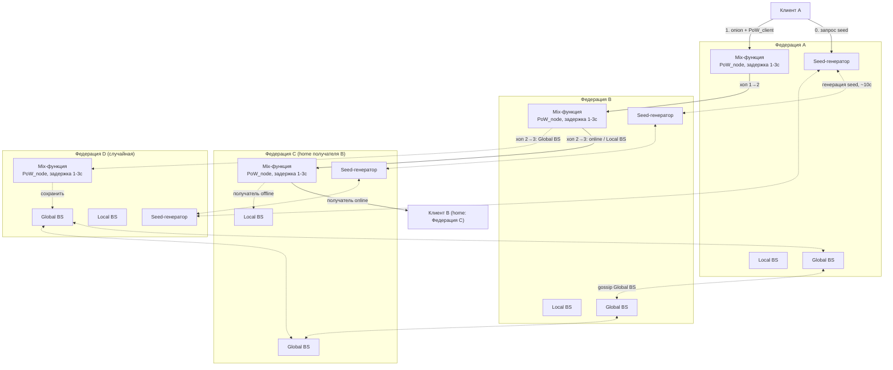
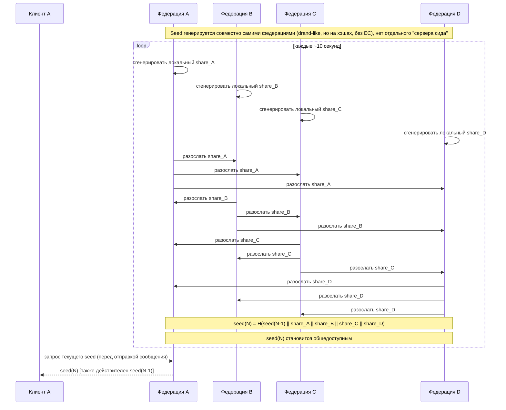
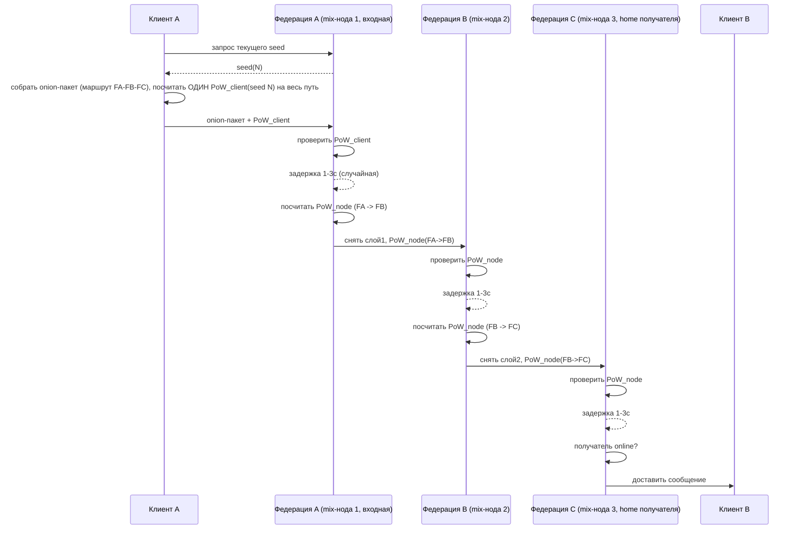
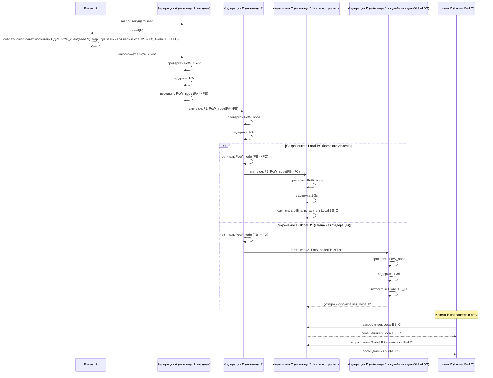

# jproto

P2P + федеративный постквантовый мессенджер. Федерации выступают mixnet-подобными узлами (луковое шифрование, случайная задержка 1–3с) и хранят offline-сообщения в двух независимых blind storage — локальном (внутри одной федерации) и глобальном (синхронизируется между федерациями).

## Термины

| Термин | Значение |
|---|---|
| **Федерация** | Один сервер = одна mixnet-нода. Все федерации равноправны. |
| **PoW_client** | Один PoW, который считает клиент на весь маршрут (все 3 хопа) сразу. |
| **PoW_node** | Отдельный PoW, который считает нода при пересылке сообщения на следующий хоп. |
| **seed(N)** | Раундовый сид (раунд ~10с), генерируется совместно всеми федерациями (drand-like, на хэшах). Действителен текущий и предыдущий раунд. |
| **seed_hour** | Тот же сид, но взятый на округлённом до часа раунде (раз в 360 раундов) — используется для адресации ячеек BS. |
| **Local BS** | Blind storage внутри одной федерации: мало ячеек, малый размер, не синхронизируется с другими федерациями. |
| **Global BS** | Blind storage большего размера, синхронизируется между всеми федерациями |
| **Ячейка (cell)** | Слот blind storage фиксированного размера на N сообщений (сейчас 50), адресуется как `H(seed_hour ‖ pk_получателя ‖ salt ‖ номер_сессии)`. |
| **salt** | Значение, согласованное парой отправитель-получатель в рамках handshake (п.7). Вместе с номером сессии рандомизирует адрес ячейки для каждой сессии переписки. |
| **номер сессии** | Счётчик, инкрементируется вручную по желанию любой стороны либо автоматически раз в N сообщений). |
| **home-нода** | Федерация, к которой "приписан" клиент; используется для самого первого сообщения между двумя клиентами, пока `salt` ещё не согласован. |

## Содержание

1. [Архитектура системы](#1-архитектура-системы)
2. [Генерация раундового seed](#2-генерация-раундового-seed)
3. [Доставка online-сообщений](#3-доставка-online-сообщений)
4. [Доставка offline-сообщений](#4-доставка-offline-сообщений)
5. [Запись и чтение сообщений в BS](#5-запись-и-чтение-сообщений-в-bs)
6. [Вытеснение сообщений в ячейке BS](#6-вытеснение-сообщений-в-ячейке-bs)
7. [Согласование нод для канала A↔B](#7-согласование-нод-для-канала-ab)

---

## 1. Архитектура системы

Каждая федерация — это один сервер, объединяющий 4 функции: генерацию сида, mix-пересылку, Local BS и Global BS. Клиент всегда идёт через ровно 3* mixnet-хопа; куда придётся третий хоп — зависит от цели (доставка клиенту, запись в Local BS его home-федерации или согласованной федерации, либо запись в Global BS случайной федерации).

---

## 2. Генерация раундового seed

Общий сид не выдаётся отдельным сервером — он вычисляется совместно всеми федерациями каждые ~10 секунд по схеме, близкой к drand, но на хэшах (без EC) ради постквантовости. Клиент перед отправкой запрашивает текущий сид у любой федерации.

---

## 3. Доставка online-сообщений

Клиент считает один `PoW_client` на весь путь (проверяется один раз, на входе), а между собой ноды дополнительно защищаются отдельным `PoW_node` на каждой пересылке. Маршрут всегда — ровно 3 mix-хопа*, третий хоп — home-федерация получателя.

---

## 4. Доставка offline-сообщений

Если получатель offline, третий хоп определяется целью: федерация получателя (Local BS) или случайная федерация Global BS.

---

## 5. Запись и чтение сообщений в BS

Адрес ячейки — `H(seed_hour ‖ pk_получателя ‖ salt ‖ номер_сессии)`. Для самого первого сообщения между парой `salt` ещё не согласован, поэтому адрес считается без него (см. п.7); после handshake обе стороны используют общий `salt` и общий счётчик сессии. `salt` и `номер_сессии` рандомизируют адрес отдельно для каждой сессии конкретной пары. Запись может идти через mixnet (анонимность отправителя), чтение — прямым подключением к ноде (без туннеля). Полезная нагрузка — постквантовый Kyber shared secret + зашифрованное им сообщение.

```mermaid
sequenceDiagram
    participant A as Клиент A (отправитель)
    participant Mix as Mixnet-туннель<br/>(3 ноды, см. п.3/п.4)
    participant Node as Нода BS<br/>(home B - первое сообщение,<br/>либо согласованная нода - далее)
    participant B as Клиент B (получатель)

    Note over A,B: Обе стороны знают: seed(округлённый до часа), pk_B, salt, номер_сессии<br/>и текущий целевой узел (home или согласованный) - согласовано в п.7

    rect rgb(30,40,30)
    Note over A: Фаза записи (всегда через mixnet, анонимно)
    A->>A: seed_hour = seed(round - round mod 360)
    A->>A: cell_index = H(seed_hour || pk_B || salt || номер_сессии)
    A->>A: (kyber_ct, shared_secret) = Kyber.Encaps(pk_B)
    A->>A: ciphertext_msg = AEAD_Encrypt(shared_secret, сообщение)
    A->>A: посчитать PoW_client на запрос записи
    A->>Mix: store(cell_index, kyber_ct, ciphertext_msg) + PoW_client
    Mix->>Node: доставка через 3 хопа (PoW_node на каждом, задержка 1-3с)
    Node->>Node: проверить PoW_client
    Node->>Node: найти ячейку cell_index, вставить запись (логика вытеснения, см. п.6)
    end

    rect rgb(25,35,50)
    Note over B: Фаза чтения (прямое подключение к ноде, без mixnet)
    B->>B: seed_hour = seed(round - round mod 360)
    B->>B: cell_index = H(seed_hour || pk_B || salt || номер_сессии)
    B->>Node: request(cell_index) напрямую
    Node->>Node: проверить PoW_client (если требуется для чтения)
    Node->>Node: собрать все записи в ячейке cell_index
    Node-->>B: список (kyber_ct_i, ciphertext_msg_i)

    loop для каждой записи в ячейке
        B->>B: shared_secret_i = Kyber.Decaps(sk_B, kyber_ct_i)
        B->>B: сообщение_i = AEAD_Decrypt(shared_secret_i, ciphertext_msg_i)
    end
    end
```

---

## 6. Вытеснение сообщений в ячейке BS

Ячейка вмещает фиксированное число сообщений (50)*. Пока есть свободное место — вставка без проверок. Когда ячейка полна, новое сообщение сравнивается по `score` (функция от PoW и возраста) с самым слабым сообщением в ячейке: если новее/сильнее — вытесняет его, иначе отклоняется. Отдельного удаления по TTL нет — сообщение живёт, пока его не вытеснят.

```mermaid
flowchart TD
    Start["Входящее сообщение M<br/>PoW-сложность P(M), метка времени t(M)"] --> Check["Ячейка: сколько сообщений сейчас?"]

    Check -->|"< 50"| Insert["Вставить M в ячейку"]
    Check -->|"= 50 (полна)"| ScoreAll["Для каждого сообщения в ячейке<br/>вычислить score = f(PoW, возраст/время жизни)"]

    ScoreAll --> ScoreNew["Вычислить score(M) по той же формуле"]
    ScoreNew --> FindWeak["Найти сообщение с минимальным score<br/>(самое 'слабое': низкий PoW и/или большой возраст)"]

    FindWeak --> Compare{"score(M) > min score в ячейке?"}
    Compare -->|"да"| Evict["Вытеснить слабейшее сообщение"]
    Evict --> Insert
    Compare -->|"нет"| Reject["Отклонить M"]

    Insert --> Live["Сообщение хранится в ячейке<br/>пока не будет вытеснено новым сообщением с более высоким score"]

    style ScoreAll fill:#2d2d2d,stroke:#888
    style ScoreNew fill:#2d2d2d,stroke:#888
```

---

## 7. Согласование нод для канала A↔B

Home-нода получателя используется только для самого первого сообщения между двумя клиентами — на этом этапе адрес ячейки ещё считается без `salt`, по чистому `H(seed_hour ‖ pk)`. Внутри этого первого сообщения отправитель предлагает 2–3 ноды для дальнейшего обмена и начальный `salt`; получатель подтверждает их (или предлагает свой вариант) в своём ответном "первом сообщении" (тоже через home-ноду отправителя). После этого все последующие сообщения между A и B идут уже через согласованные ноды, а адрес ячейки считается как `H(seed_hour ‖ pk ‖ salt ‖ номер_сессии)`. Номер сессии увеличивается вручную по желанию любой стороны либо автоматически раз в N сообщений.

```mermaid
sequenceDiagram
    participant A as Клиент A
    participant Mix as Mixnet-туннель (3 ноды)
    participant HomeB as Home-нода B
    participant HomeA as Home-нода A
    participant N1 as Согласованная нода 1
    participant N2 as Согласованная нода 2
    participant B as Клиент B

    rect rgb(40,30,30)
    Note over A,B: Первое сообщение - адресат неизвестен, используется home-нода получателя
    A->>A: cell_index_B = H(seed_hour || pk_B)
    A->>A: Kyber.Encaps(pk_B), зашифровать сообщение<br/>+ предложить список нод [N1, N2] и начальный salt
    A->>Mix: store(cell_index_B, ...) + PoW_client
    Mix->>HomeB: доставка (3 хопа)
    HomeB->>HomeB: вставить в ячейку

    B->>HomeB: request(cell_index_B) напрямую
    HomeB-->>B: запись A
    B->>B: Kyber.Decaps(sk_B), расшифровать
    B->>B: получены [N1, N2] и salt
    end

    rect rgb(30,30,45)
    Note over A,B: Ответ B (тоже первое сообщение для A, снова через home)
    B->>B: cell_index_A = H(seed_hour || pk_A)
    B->>B: Kyber.Encaps(pk_A), зашифровать ответ<br/>+ подтвердить [N1, N2] и salt (или предложить свой вариант)
    B->>Mix: store(cell_index_A, ...) + PoW_client
    Mix->>HomeA: доставка (3 хопа)
    HomeA->>HomeA: вставить в ячейку

    A->>HomeA: request(cell_index_A) напрямую
    HomeA-->>A: запись B
    A->>A: Kyber.Decaps(sk_A), расшифровать
    A->>A: канал согласован: ноды [N1, N2], salt, номер_сессии = 1
    end

    rect rgb(30,40,30)
    Note over A,B: Все последующие сообщения - через согласованные ноды и salt
    A->>A: cell_index_B = H(seed_hour || pk_B || salt || номер_сессии)
    A->>Mix: store(cell_index_B, ...) + PoW_client (адресат: N1 или N2)
    Mix->>N1: доставка (3 хопа)
    N1->>N1: вставить в ячейку

    B->>N1: request(cell_index_B) напрямую
    N1-->>B: записи от A
    end
```

'* - требуется уточнение'
